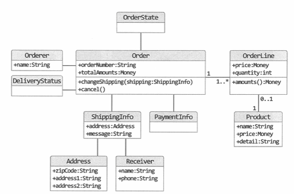

# Chapter 1 - 도메인 모델 시작하기
### 1.1 도메인이란?
소프트웨어로 해결하고자 하는 문제 영역.   
ex) 구매, 결제, 배송 등..

도메인의 구성은 필요에 따라 달라진다.

### 1.2 도메인 전문가와 개발자 간 지식 공유
> Garbage in, Garbage out  
잘못된 요구사항은 잘못된 제품으로 이어진다.

개발진행에 앞서 요구사항에 대한 올바른 이해가 중요하다.
올바른 요구사항을 이해하기 위한 방법은?
- 개발자와 도메인 전문가와의 정확한 소통
- 개발자의 도메인 역량 증대

### 1.3 도메인 모델
도메인 모델 : 특정 도메인을 개념적으로 표현한 것. 
도메인 모델을 사용하면 여러 관계자들이 동일한 모습으로 도메인을 이해하고 도메인 지식을 공유하는데 도움이 된다. 
도메인 모델은 객체 모델링 뿐 아니라 상태 전이 모델링으로도 표현이 가능하며, 상황에 따라 그래프나 공식 등을 활용 표현 가능하다.

각 하위 도메인이 다루는 영역은 서로 다르기 때문에 같은 용어라도 도메인 마다 의미가 다를 수 있다. 
도메인에 따라 용어 의미가 결정되므로 하위 도메인을 하나의 다이어그램에 모델링 하면 안 된다.  
즉, 하위 도메인 마다 별도로 모델을 만들어야 한다.

### 1.4 도메인 모델 패턴
| 영역 | 설명 |
| ------ | ------ |
| 표현 | 사용자의 요청을 처리하고 사용자에게 정보를 보여준다.   사용자는 소프트웨어 이용자 뿐 아니라 외부 시스템일 수 있다. |
| 응용 | 요청받은 기능을 실행한다.   업무 로직을 직접 구현하지 않으며 도메인 계층을 조합해서 기능을 실행한다. |
| 도메인 | 시스템이 제공할 도메인 규칙을 구현한다. |
| 인프라스트럭쳐 | DB나 메시징 시스템과 같은 외부 시스템과의 연동을 처리한다. |

### 1.5 도메인 모델 도출
기획서, 유스 케이스, 사용자 스토리와 같은 요구사항과 관련자와의 대화를 통해 도메인을 이해하고 이를 바탕으로 도메인 모델 초안을 만들어야 비로소 코드를 작성할 수 있다.  
즉, 구현을 시작하려면 도메인에 대한 초기 모델이 필요하다.  
도메인을 모델링할 때 기본이 되는 작업은 모델을 구성하는 핵심 구성요소, 규칙, 기능을 찾는 것이다.

도메인을 구현하다 보면 특정 조건이나 상태에 따라 제약이나 규칙이 달리 적용되는 경우가 많다.

요구사항 정련을 위해 도메인 전문가나 다른 개발자와 논의하는 과정에서 공유하기도 한다. 모델을 공유할 때는 화이트보드나 위키와 같은 도구를 사용해서 누구나 쉽게 접근할 수 있도록 하면 좋다.

> 문서화 문서화를 하는 주된 이유는 지식을 공유하기 위함이다.   
> 전반적인 기능 목록이나 모듈 구조, 빌드 과정은 코드를 보고 직접 이해하는 것보다 상위 수준에서 정리한 문서를 참조하는 것이 소프트웨어 전반을 빠르게 이해하는 데 도움이 된다.

### 1.6 엔티티와 밸류

### 1.7 도메인 용어와 유비쿼터스 언어