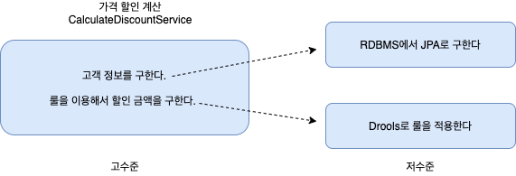
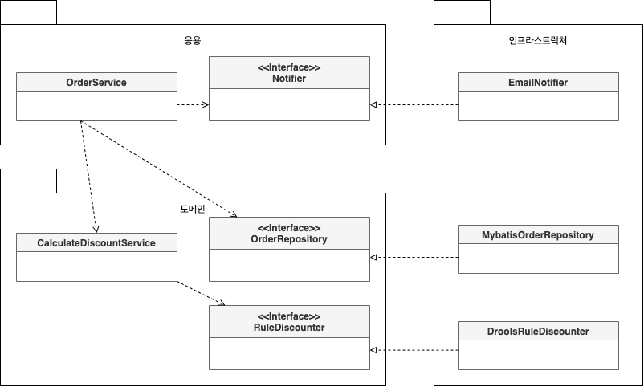

# Chapter 2 - 아키텍처 개요
## 2.1 네 개의 영역

### 표현 영역 ( Presentation )

- 사용자의 요청을 받아 Application 영역에 전달하고 Application 영역의 처리 결과를 다시 사용자에게 보여주는 역할
- 스프링 MVC 프레임워크가 presentation 영역을 위한 기술에 해당
- 웹 어플리케이션에서 Presentation 영역의 사용자는 웹 브라우저를 사용하는 사람 혹은 REST API 를 호출하는 외부 시스템일 수 있다.
- HTTP 요청을 Application 영역이 필요로 하는 형식으로 변환해서 Application 영역에 전달하고, Application 영역의 응답을 HTTP 응답으로 변환해서 전송한다.

### 응용 영역 ( Application )

- 표현 영역을 통해 사용자의 요청을 전달받아 시스템이 사용자에게 제공해야 할 기능을 구현한다.
- 기능을 구현하기 위해 도메인 영역의 도메인 모델을 사용한다.
- 응용 서비스는 로직을 직접 수행하기 보다는 도메인 모델에 로직 수행을 위임한다.


### 도메인 영역 ( Domain )
- 도메인 모델은 도메인의 핵심 로직을 구현한다

### 인프라스트럭처 영역 ( Infrastructure )
- 구현 기술에 대한 것을 다룬다. 이 영역은 RDBMS 연동 처리, 메시징 큐에 메시지를 전송하거나 수신하는 기능을 구현한다
- 논리적인 개념을 표현하기보다는 실제 구현을 다룬다.

## 2.2 계층 구조 아키텍처

Presentation, Application 영역은 Domain 영역을 사용하고, Domain 영역은 Infrastructure 영역을 사용하므로 계층 구조를 적용하기에 적당하다. <br /> 
Domain 복잡도에 따라 Application과 Domain 을 분리하기도 하고 한 계층으로 합치기도 한다. <br />
계층 구조는 그 특성상 상위 계층에서 하위 계층으로서의 의존만 존재하고 하위 계층은 상위 계층에 의존하지 않는다. 


응용 영역과 도메인 영역은 DB나 외부 시스템 연동을 위해 인프라스트럭처의 기능을 사용하므로 이런 계층 구조를 사용하는 것은 직관적으로 이해하기 쉽다. <br/>
하지만, 표현/응용 계층이 상세한 구현 기술을 다루는 인프라스트럭처 계층에 종속될수 있는 위험이 있다.

인프라스트럭처에 의존하면 '테스트 어려움'과 '기능 확장의 어려움'이라는 두 가지 문제가 발생한다.

## 2.3 DIP



CalculateDiscountService는 고수준 모듈이다. 고수준 모듈의 기능을 구현하려면 여러 하위 기능이 필요하다. <br/>
(고객정보 구하기, 할인 금액 계산하기) 저수준 모듈은 하위 기능을 실제로 구현한 것이다.

고수준 모듈이 제대로 동작하려면 저수준 모듈을 사용해야 한다. <br />
그런데 고수준 모듈이 저수준 모듈을 사용하면 앞서 계층 구조 아키텍처에서 언급했던 두 가지 문제가 발생한다.

DIP는 이를 해결하기 위해 저수준 모듈이 고수준 모듈에 의존하도록 바꾼다. 원리는 추상화한 인터페이스에 있다.

```
public interface RuleDiscounter {
    public Money applyRules(Customer customer, List<OrderLine> orderLines);
}
```

CalculateDiscountService가 RuleDiscounter를 이용하도록 변경
```
public class CalculateDiscountService {
	private CustomerRepository customerRepository;
	private RuleDiscounter ruleDiscounter;

	public Money calculateDiscount(OrderLine orderLines, String customerId) {
		Customer customer = customerRepository.findCusotmer(customerId);
		return ruleDiscounter.applyRules(customer, orderLines);
	}
}
```

DroolsRuleEngine 클래스를 RuleDiscounter 인터페이스로 구현체로 변경
```
public class DroolsRuleDiscounter implements RuleDiscounter{
	private KieContainer kContainer;

	@Override
	public void applyRules(Customer customer, List<OrderLine> orderLines) {
		...
	}
}
```

CalculateDiscountService는 '룰을 이용한 할인 금액 계산'을 추상화한 RuleDiscounter 인터페이스에 의존할 뿐이다.<br />
DroolsRuleDiscounter는 고수준의 하위 기능인 RuleDiscounter를 구현한 것이므로 저수준 모듈에 속한다.

CalculateDiscountService가 제대로 동작하는지 테스트하려면 CustomerRepository와 RuleDiscounter를 구현한 객체가 필요하다. <br />
만약 CalculateDiscountService가 저수준 모듈에 직접 의존했다면 저수준 모듈이 만들어지기 전까지 테스트를 할 수가 없었겠지만<br/>
CustomerRepository와 RuleDiscounter는 인터페이스이므로 대용 객체(Mock)를 사용해서 테스트를 진행할 수 있다


### DIP 주의사항
DIP는 단순히 인터페이스와 구현 클래스를 분리하기 위함이 아니라 고수준 모듈이 저수준 모듈에 의존하지 않도록 하기 위함이다.

DIP를 적용할 때 하위 기능을 추상화한 인터페이스는 고수준 모듈 관점에서 도출한다.

### DIP 와 아키텍처

인프라스트럭처 영역은 구현 기술을 다루는 저수준 모듈이고 응용 역영과 도메인 영역은 고수준 모듈이다.

인프라스트럭처 계층의 가장 하단에 위치하는 계층형 구조와 달리 아키텍처에 DIP를 적용하면 인프라스트럭처 영역이 응용 영역과 도메인 영역에 의존(상속)하는 구조가 된다.



## 2.4 도메인 영역의 주요 구성요소

## 2.5 요청 처리 흐름

## 2.6 인프라스트럭쳐 개요

## 2.7 모듈 구성
