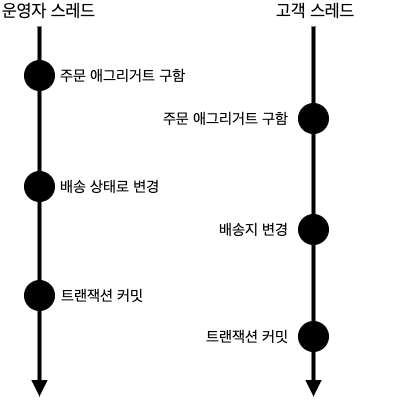
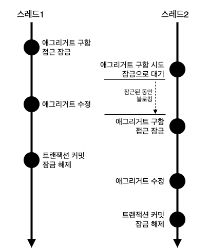

# Chapter 8 - 애그리거트 트랜잭션 관리

## 8.1 애그리거트와 트랜잭션

 

한 애그리거트를 두 사용자가 거의 동시에 변경할 때 트랜잭션이 필요하다.  
위 예시는 두 스레드는 각각 트랜잭션을 커밋할 때 수정한 내용을 DBMS에 반영해서 애그리거트의 일관성이 깨질수 있는 상황이다.

**문제 해결 방법**
1. 선점 잠금 방식(비관적 잠금)
   운영자가 배송지 정보를 조회하고 상태를 변경하는 동안 고객이 애그리거트를 수정하지 못하게 막는다.
2. 비선점 잠금 방식(낙관적 잠금)
   운영자가 배송지 정보를 조회한 이후에 고객이 정보를 변경하면 운영자가 애그리거트를 다시 조회한 뒤 수정하도록 한다.

## 8.2 선점 잠금

먼저 애그리거트를 구한 스레드가 애그리거트 사용이 끝날 때까지 다른 스레드가 해당 애그리거트를 수정하는 것을 막는 방식  



스레드1이 선점 잠금 방식으로 애그리거트를 구한 뒤 이어서 스레드2가 같은 애그리거트를 구하고 있다.  
이 경우 스레드2는 스레드1이 애그리거트에 대한 잠금을 해제할 때까지 블로킹된다.

JPA의 EntityManager는 LockModeType을 인자로 받는 find() 메서드를 제공하는다.
```
Order order = entityManager.find(Order.class, orderNo, LockModeType.PESSIMISTIC_WRITE);
```
하이버네이트의 경우 `PESSIMISTIC_WRITE`를 잠금 모드로 사용하면 `for update` 쿼리를 사용해서 선점 잠금을 구현한다.  
`for update`와 같은 쿼리를 사용해서 특정 레코드에 한 사용자만 접근할 수 있는 잠금 장치를 제공한다.

### 8.2.1 선점 잠금과 교착상태

선점 잠금 기능을 사용할 때는 잠금 순서에 따른 교착 상태<sup>deadlock</sup>가 발생하지 않도록 주의해야한다.

1. 스레드1 : A 애그리거트에 대한 선점 잠금 구함
2. 스레드2 : B 애그리거트에 대한 선점 잠금 구함
3. 스레드1 : B 애그리거트에 대한 선점 잠금 시도
4. 스레드2 : A 애그리거트에 대한 선점 잠금 시도

--> 서로 자신의 자원을 못놓고 상대의 자원을 요청하는 상황

선점 잠금에 따른 교착 상태는 상대적으로 사용자 수가 많을 때 발생할 가능성이 높고, 사용자 수가 많아지면 교착 상태에 빠지는 스레드가 더 빠르게 증가하게 된다.  
이런 문제가 발생하지 않도록 하려면 잠금을 구할 때 최대 대시 시간을 지정해야 한다.  
JPA에서 선점 잠금을 시도할 때 최대 대기 시간을 지정하려면 다음과 같이 힌트를 사용하면 된다.

```
Map<String, Object> hints = new HashMap<>();
hints.put("javax.persistence.lock.timeout", 2000);
Order order = entityManager.find( Order.class, orderNo,	LockModeType.PRESSIMISTIC_WRITE, hints);
```

## 8.3 비선점 잠금


### 8.3.1 강제 버전 증가

## 8.4 오프라인 선점 잠금

### 8.4.1 오프라인 선점 잠금을 위한 LockManager 인터페이스와 관련 클래스

### 8.4.2 DB를 이용한 LockManager 구현


