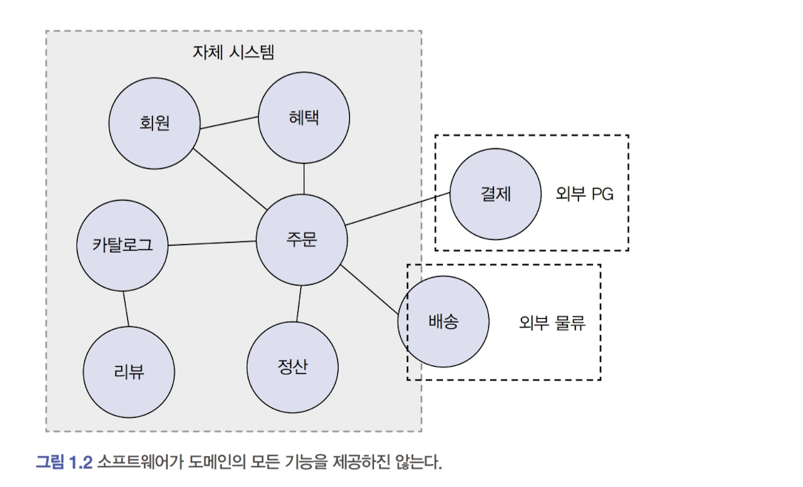
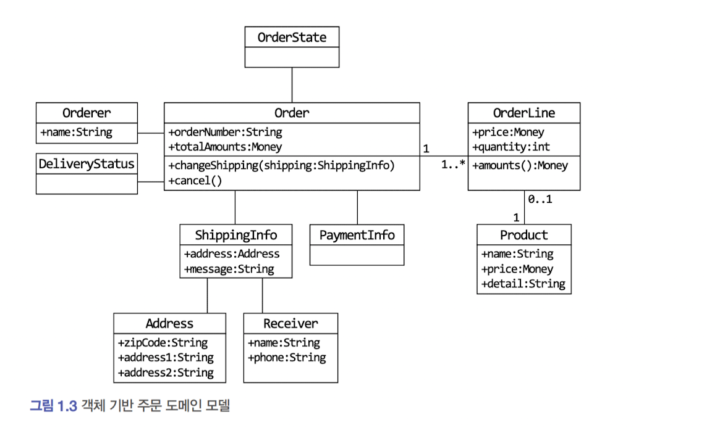
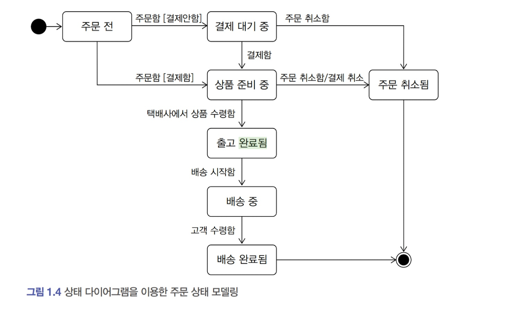

# Chapter1 도메인 모델 시작하기

## 1.1 도메인이란?



* 도메인이란 소프트웨어로 해결하고자 하는 문제 영역 이다.
* 한 도메인은 다시 하위 도메인으로 나눌 수 있으며, 한 하위 도메인은 다른 하위 도메인과 연동하여 완전한 기능을 제공 한다.
    * 온라인 서점이라는 도메인은 `카탈로그`를 통해 물품을 확인한 `회원`이 `주문`하여 `배송`받는 여러 하위 도메인들의 연동을 통해 이루어 진다.
* 특정 도메인을 위한 소프트웨어라고 해서 도메인이 제공해야 할 모든 기능을 직접 구현하는 것은 아니다
    * 위의 예시에서 결제 도메인은 PG사의 시스템을 배송 도메인은 외부 물류 업체 시스템을 이용한다.
* 도메인마다 고정된 하위 도메인이 존재하는 것은 아니다.
* 하위 도메인을 어떻게 구성할지 여부는 상황에 따라 달라진다.

---

## 1.2 도메인 전문가와 개발자 간 지식 공유

* 개발자는 요구사항을 분석하고 설계하여 코드를 작성하며 테스트하고 배포한다.
    * 코딩에 앞서 요구사항을 올바르게 이해하는 것이 중요하다.
    * 요구사항을 제대로 이해하지 않으면 쓸모없거나 유용함이 떨어지는 시스템이 만들어 진다.
    * 요구사항을 잘못 이해하면 변경하거나 다시 만들어야 할 코드가 많아지고, 제품을 만드는데 실패하거나 일정이 크게 밀리기도 한다.
* 요구사항을 올바르게 이해하려면 개발자와 전문가가 직접 대화하는 것이 좋다.
    * 개발자와 전문가 사이에 내용 전달자가 많으면 많을수록 정보가 왜곡되고 손실이 발생하며, 요구사항과 다른것을 만들게 될 수 있다.
* 도메인 전문가 만큼은 아니더라도 이해관계자와 개발자도 도메인 지식을 갖춰야 한다.
    * 제품 개발과 관련된 사람들이 같은 지식을 공유하고 직접 소통할 수록 도메인 전문가가 원하는 제품을 만들 가능성이 커진다.

---

## 1.3 도메인 모델

* 도메인 모델은 특정 도메인을 개념적으로 표현한 것이다



* [그림 1.3] 객체 모델은 도메인의 모든 내용을 담고 있지는 않지만 이 모델을 보면 도메인이 지니고 있는 기능과 주요 데이터 구성을 파악하는데 도움이 된다.

    * 주문 (Order)은 주문번호(orderNumber)와 지불할 총금액(totalAmounts )이 있고, 배송정보(ShippingInfo)를 변경(
      changeShipping) 할 수 있음을 알 수 있다
* 도메인 모델을 객체로만 모델링 할 수 있는 것은 아니다

    * [그림 1.4] 상태 다이어그램을 이용해서 주문의 상태 전이를 모델링 할 수 있다.



* 도메인을 이해하는데 도움이 된다면 표현 방식이 무엇인지는 중요하지 않다.
    * UML, 그래프, 수학 공식등 다양한 방식으로 도메인 모델을 만들 수 있다.
* 도메인 모델은 기본적으로 도메인 자체를 이해하기 위한 개념 모델이다.
    * 개념 모델을 이용해서 바로 코드를 작성할 수 있는것은 아니므로 구현 기술에 맞는 구현 모델이 따로 필요하다.
    * 객체 기반 모델을 이용했다면 객체 지향 언어를 이용한 구현 모델이 있다.

**하위 도메인과 모델**

* 각 하위 도메인이 다루는 영역은 서로 다르기 때문에 같은 용어라도 하위 도메인에 따라 의미가 달라질 수 있다.
    * 카탈로그 도메인에서 `상품`은 상품 가격, 상세 내용을 담고 있는 정보
    * 배송 도메인에서 `상품`은 물리적인 상품을 의미한다.
* 도메인에 따라 용어 의미가 결정되므로 여러 하위 도메인을 하나의 다이어그램에서 모델링 해서는 안된다.
* 모델의 구성요소는 특정 도메인으로 한정할 때 의미가 완전해지므로 별도로 모델을 만들어야 한다.

---

## 1.4 도메인 모델 패턴


* 일반적으로 애플리케이션 아키텍처는 네 개의 영역으로 구성 된다. [그림 1.5]
* 앞서 살펴본 도메인 모델은 도메인 자체를 이해하는데 필요한 개념 모델이라면, 이 장에서 살펴보는 도메인 모델은 [앤터프라이즈 애플레키이션 아키택처 패턴]책에 나오는 도메인 모델
  패턴을 의미한다.
    * **여기서 말하는 도메인 모델은 아키텍처 상의 도메인 계측을 객체 지향 기법으로 구현하는 패턴을 말한다.**

주문 도메인 예제를 살펴보자 **[\[예제\]](./bookstore/domain/order/Order.java)**

**개념 모델과 구현 모델**

* 개념 모델은 순수하게 문제를 분석한 결과물이다.
    * 개념 모델은 데이터베이스, 트랜잭션 처리, 성능, 구현 기술 같은것을 고려하지 않으므로 실제 코드를 작성할때 그대로 사용할 수 없다.
* 개념 모델을 구현 가능한 형태로 전환한 것을 구현 모델이라 한다.
* 처음 부터 완벽하게 도메인을 표한하는 도메인을 만드는것은 실제로 불가능하다.
    * 전반적인 개요를 알 수 있는 수준으로 개념 모델을 작성한 후 구현하는 과정에서 개념 모델을 구현 모델로 점진적으로 발전시켜 나가는것이 좋다.

---

## 1.5 도메인 모델 도출

* 도메인에 대한 이해 없이 코딩을 시작할 수 없다.
* 구현을 시작하기 위해서는 도메인에 대한 초기 모델이 필요하다.
* 도메인을 모델링 할 때 기본이 되는 작업은 모델을 구성하는 핵심 구성요소, 규칙, 기능을 찾는 것이다.
* 이 과정은 요구사항에서 출발한다.

**예제로 주문 도메인과 관련된 요구사항을 살펴보자**

> - 최소 한 종류 이상의 상품을 주문해야 한다
> - 한 상품을 한 개 이상 주문할 수 있다
> - 총 주문 금액은 각 상품의 구매 가격 합을 모두 더한 금액이다
> - 각 상품의 구매 가격 합은 상품 가격에 구매 개수를 곱한 값이다
> - 주문할 때 배송지 정보를 반드시 지정해야 한다
> - 배송지 정보는 받는 사람 이름, 전화번호, 주소로 구성된다
> - 출고를 하면 배송지를 변경할 수 있다
> - 출고 전에 주문을 취소할 수 있다
> - 고객이 결제를 완료하기 전에는 상품을 준비하지 않는다

1. 이 요구사항에서 알 수 있는 것은 주문은 ‘출고 상태로 변경하기’, ‘배송지 정보 변경하기’, ‘주문 취소하기’, ‘결제 완료하기’ 기능을 제공한다는
   것이다. [\[예제\]](./bookstore/domain/order2/Order.java)

2. 다음 요구사항으로 주문 항목(OrderLine)이 주문할 상품, 상품의 가격, 구매 개수를 포함하는 동시에 각 항목의 구매 가격도 제공해야 한다는
   사실이다. [\[예제\]](./bookstore/domain/order2/OrderLine.java)
    1. 한 상품을 한 개 이상 주문할 수 있다.
    2. 각 상품의 구매 가격 합은 상품 가격에 구매 개수를 곱한 값이다.


* 위와 같이 주문과 관련된 요구사항에서 도메인 모델을 점진적으로 만들어 나갈 수 있다.
* 이렇게 만든 모델은 요구사항 정련을 위해 도메인 전문가나 다른 개발자와 논의하는 과정에서 공유되기도 한다.

**문서화**

* 문서화의 주된 이유는 지식을 공유하기 위함이다.
* 코드를 이용해서 전체 소프트웨어를 분석하려면 많은 시간을 투자해야 하므로 상위 수준에서 정리한 문서를 참조하는 것이 좋다.
* 코드를 보면서 도메인을 깊게 이해하게 되므로 코드 자체도 문서화의 대상이 된다.
* 도메인 관점에서 코드가 도메인을 잘 표현해야 비로서 코드 가독성이 높아지고 문서로서 코드가 의미를 가진다.

---

## 1.6 엔티티와 밸류

[그림 1.6]은 1.5과정에서 도출해낸 모델이다.


* 해당 모델에는 크게 엔티티와 밸류로 구분할 수 있다.
* 엔티티와 모듈을 제대로 구분해야 도메인을 올바르게 설계하고 구현할 수 있으므로 이 둘의 차이를 명확하게 이해해야만 도메인을 잘 구현할 수 있다.

### 1.6.1 엔티티 [\[예제\]](./bookstore/domain/order3/Order.java)

* 엔티티의 가장 큰 특징은 **식별자**를 가진다
    * 식별자는 엔티티 객체마다 고유해서 각 엔티티는 서로 다른 식별자를 가진다.
    * 엔티티의 식별자는 바뀌지 않는다.
* 엔티티의 식별자는 바뀌지 않고 고유하므로 두 엔티티의 식별자가 같은 두 엔티티는 같다고 판단할 수 있다.

### 1.6.2 엔티티의 식별자 생성

* 엔티티의 식별자를 생성하는 시점은 도메인의 특징과 사용하는 기술에 따라 달라진다.
* 흔히 식별자는 다음 중 한 가지 방식으로 생성한다.
    * 특정 규칙에 따라 생성
    * UUID나 Nano ID와 같은 고유 식별자 생성기 사용
    * 값을 직접 입력
    * 일련번호 사용 (시퀀스나 DB의 자동 증가 컬럼)

* 자동 증가 컬럼을 제외하면 식별자를 먼저 만들고 엔티티 객체를 생성 할 때 식별자를 전달한다.

```java
// 엔티티를 생성하기 전에 식별자 생성
String orderNumber=orderRepository.generateOrderNumber();
    Order order=new Order(orderNumber,....);
    orderRepository.save(order
```

* 자동 증가 컬럼은 DB에 데이터를 삽입해야 비로소 값을 알수 있기때문에 생성자로 엔티티를 생성할때 식별자를 넘겨 줄 수 없다.

```java
Article article=new Article(author,title,...);
    articleRepository.save(article); // DB에 저장한 뒤 구한 식별자를 엔티티에 반영
    Long savedArticleId=article.getId(); // DB에 저장한 후 식별자 참조 가능
```

### 1.6.3 밸류 타입


* [그림 1.8]에서와 같이 ShippingInfo 는 `받는 사람`과 `주소`에 대한 데이터를 갖고 있다.
    * reciever*** 필드는 받는 사람이라는 하나의 개념을 표현 한다.
    * shipping*** 필드는 주소라는 하나의 개념을 표현 한다.
* **밸류 타입은 개념적으로 완전한 하나를 표현할 때 사용한다.** [\[예제\]](./bookstore/domain/order3/ShippingInfo.java)
    * Receiver 는 그 자체로 받는 사람을 뜻한다.
    * Address 는 그 자체로 주소를 의미한다.
* 두 밸류 객체를 비교할 때는 모든 속성이 같은지 비교한다.

다른 예제로 OrderLine 의 price 와 amount 필드는 int타입의 숫자를 사용하지만 이들은 '돈'을 의미하는 값이다. 따라서 '돈'을 의미하는 Money타입을 만들어
사용하면 **코드를 이해하는데 도움이 된다.** [\[예제\]](./bookstore/domain/order3/OrderLine.java)

* 다른 장점으로는 밸류 타입을 위한 **기능을 추가할 수 있다**는 것이다. [\[예제\]](./bookstore/domain/order3/Money.java)

### 1.6.4 엔티티 식별자와 밸류타입

* 위에서 살펴본 밸류타입의 특징 덕분에 밸류타입을 엔티티의 식별자로 사용하면 좋다.
    * 그 자체로 개념적으로 완전한 하나를 표현한다.
    * 코드를 이해하는데 도움이 된다.
    * 기능을 추가할 수 있다.

### 1.6.5 도메인 모델에 set 메서드 넣지 않기

* set 메서드는 도메인의 핵심 개념이나 의도를 코드에서 사라지게 한다.
    * changeShippingInfo() 는 배송지 정보를 새로 변경한다는 의도를 갖지만
    * setShippingInfo() 는 단순히 배송지 값을 설정한다는것을 의미한다
* set 메서드는 도메인 객체를 생성할 때 온전하지 않은 상태가 될 수 있다.
    * 도메인을 생성할때 값을 전달하고 검증하는게 좋다.

[set을 이용한 예제]

```java
// set 메서드로 데이터를 전달하도록 구현하면
// 처음 Order를 생성하는 시점에 order는 완전하지 않다.
Order order=new Order();
// set 메서드로 필요한 모든 값을 전달해야 함
    order.setOrderLine(lines);
    order.setShippingInfo(shippingInfo);

// 주문자(Orderer)를 설정하지 않은 상태에서 주문 완료 처리
    order.setState(OrderState.PREPARING);
```

[생성자를 이용한 예제]

```java
Order order=new Order(orderer,lines,shippingInfo,OrderState.PREPARING);
```

* 애초에 불변 객체로 밸류타입을 구현하면 setter 걱정을 할 필요가 없다.

---


## 1.7 도메인 용어와 유비쿼터스 언어

* 코드를 작성할 때 사용하는 용어는 매우 중요하다.
* 도메인에서 사용하는 용어를 코드에 반영하지 않으면 그 코드는 개발자에게 코드의 의미를 전달하는데 부담을 준다. [\[예제\]](./bookstore/domain/order4/Order.java)
* 도메인에서 사용하는 용어를 코드에 그대로 써야 코드 가독성을 늘려주며 코드를 분석하고 이해하는 시간을 줄여줄 수 있다.
* 에릭 에반스는 도메인 주도 설계에서 언어의 중요함을 강조하기 위해 유비쿼터스 언어라는 용어를 사용했다.
  * 전문가, 관계자, 개발자가 공통의 언어를 만들고 이를 모든 곳에서 같은 용어를 사용하도록 해서. 소통과정의 발생하는 용어의 모호함을 줄이고 개발자는 도메인과 코드 사이에서 불필요한 해석과정을 줄일 수 있도록 한것.
* 시간이 지날 수록 도메인에 대한 이해도가 올라가면 그에 적절한 용어를 다시 공통언어로 만들어서 사용해야 한다.
* 한국인은 불리한게 있다..... 망할 영어