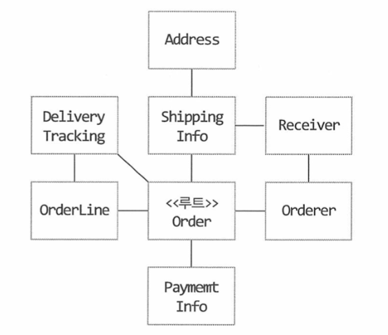

# 3장. 애그리거트

## 3.1 애그리거트


- 복잡한 도메인을 관리하기 쉬운 상위 모델에서 볼 수 있는 방법이 필요한데 그 방법이 애그리거트다.


- 애그리거트는 동일한 라이프 사이클을 가지고 대부분 함께 생성되고 제거된다. [code](./domain/order/Order.java)
- 한 애그리거트의 구성요소?
  - 같이 생성되거나 함께 변경되는 빈도가 높다면 한 애그리거트에 속할 가능성이 높다. (Product vs Review -> 다른 애그리거트)

## 3.2 애그리거트 루트

- 애그리거트에 속한 모든 객체가 일관된 데이터를 유지하기 위해 관리의 책임을 지는 주체가 필요한데 이걸 애그리거트 루트라 부른다.



```java
Order order = member.getRecenOrder();
order.setAddress("성남시 ~~");
```

- 애그리거트 루트를 통해서만 도메인 로직을 구현하게 만들려면 두 가지를 기억하자.
  - public한 set 메소드를 제공하지않는다.
    - public set 메소드는 도메인 모델에서 수정하는게 아니라 다른 layer로 수정 범위를 분산시킨다.
    - public set 메소드를 쓰지 않으면 cancel, changeAddress 등 의미가 드러나는 이름을 사용할 수 있다.
  - 밸류 타입은 불변으로 구현한다.
    - 외부에서 애그리거트 루트를 통해 구한 밸류를 변경할 수 없다.
    - 밸류 타입의 상태 변경은 오직 애그리거트 루트를 통해서만 가능하다.

- 애그리거트 루트는 내부의 다른 객체를 조합하거나 위임을 통해 기능을 완성한다.
  - 조합 [code](./domain/order/Order.java)
  - 위임 [code](./domain/order/OrderLines.java)
    - 만약 Order에서 OrderLines를 외부로 제공해야 한다면 불변 객체를 생성 or 메소드를 패키지, protected 레벨로 수정하자.

- 한 트랜잭션에는 한 개의 애그리거트만 수정하자.
  - 나쁜 예 [code](./domain/order/Order.java)
  - 부득이하게 해야 한다면 service에서 각 애그리거트 상태를 변경한다. [code](./domain/order/OrderService.java)
